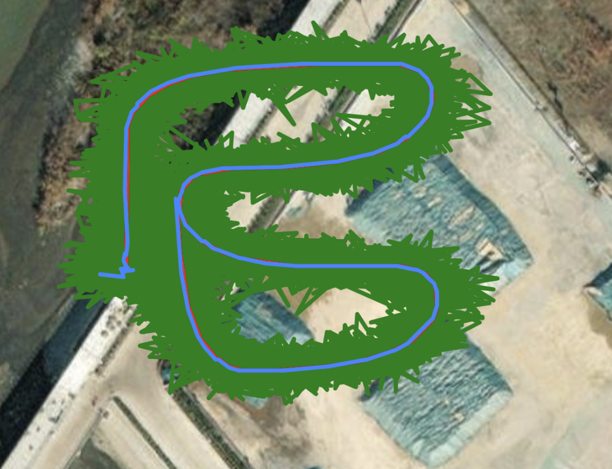

# Sesnor Fusion in C

This repo has a C implementation of a loosely coupled extended Kalman filter. I wrote the original implementation in Python, which can be found in [this](https://github.com/Egray180/sensor-fusion-testing) repo. Other versions and applications of the software can be found on the UBC AeroDesign page. I ported it over to C to run on an STM32H723ZG, and used CMSIS-DSP for the matrix operations. 

## Demo
This is a simulated test flight with 100Hz IMU sample rate and 10Hz GPS sample rate:

The red trace in the map (true path) and the blue trace (path generated with the algorithm from emulated IMU and GPS data) overlap almost perfectly once
initial GPS noise is filtered out. The data has injected noise to resemble realistic conditions, and the green path shows the raw GPS data. 

## STM32CubeIDE

To build it on STM32CubeIDE with integrated CMSIS-DSP, I had to manually include these files:

`arm_mat_add_f64.c`  
`arm_mat_init_f64.c`  
`arm_mat_inverse_f64.c`  
`arm_mat_mult_f64.c`  
`arm_mat_scale_f64.c`  
`arm_mat_sub_f64.c`  
`arm_mat_trans_f64.c`
